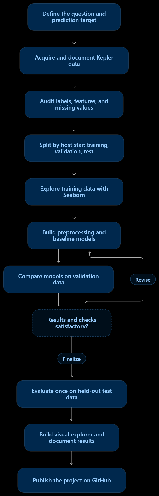

## Starlink
# PROBLEM STATEMENT:
Develop a reproducible supervised machine-learning system that classifies labelled Kepler observations as confirmed planets or false positives using selected transit and stellar measurements. Use visual analysis to explain the data, evaluate the predictions, and investigate classification errors.

# WORKFLOW

  

